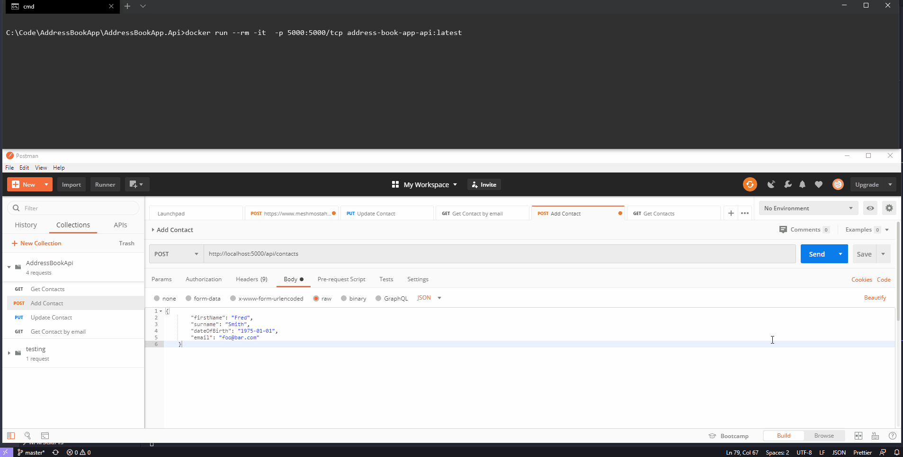

# AddressBookApp.Api
[](https://github.com/rogue-elephant/AddressBookApp.Api/actions)

Dotnet Core API using EF Core for handling an address book.

# Running locally
Clone the repository and then `cd` into AddressBookApp.Api\AddressBookApp.Api

```
AddressBookApp.Api\AddressBookApp.Api> docker build . -t address-book-app-api
```

Once the image has been built you can run:

```
docker run --rm -it  -p 5000:5000/tcp address-book-app-api:latest
```

And you should be able to open the `AddressBookApi.postman_collection` file inside postman to try out the different commands.


